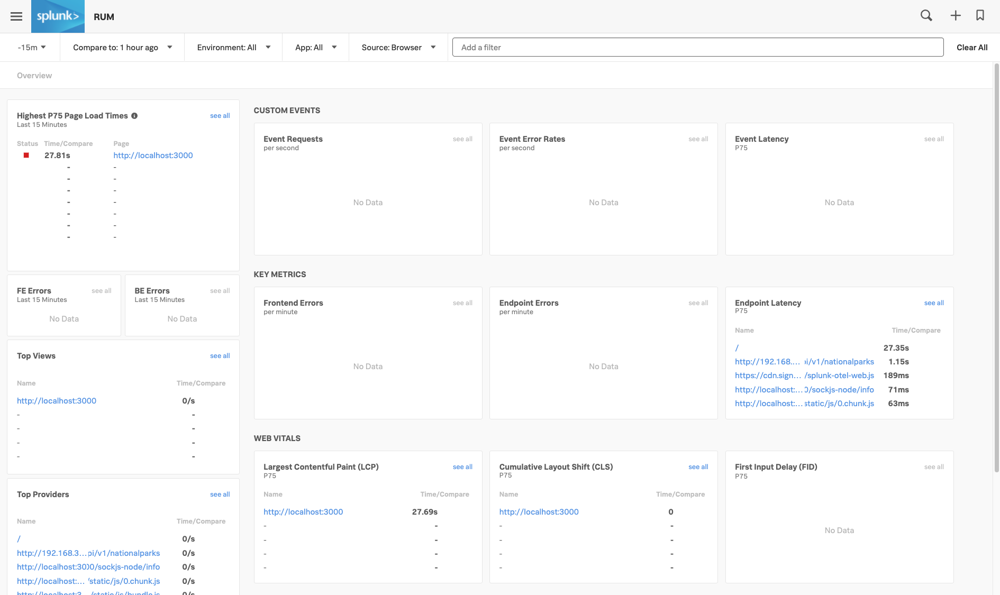
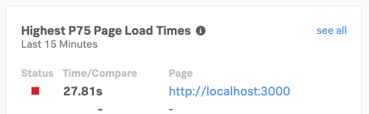
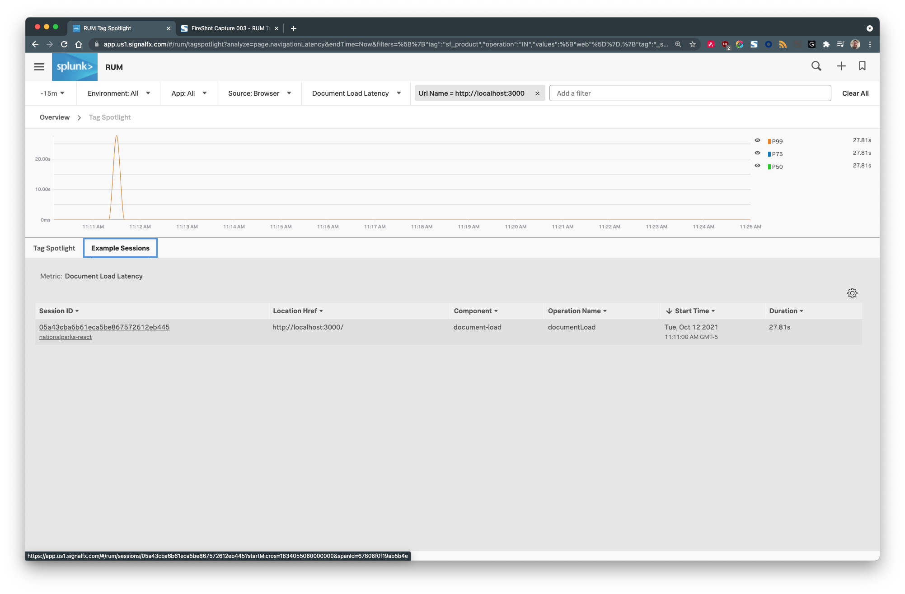
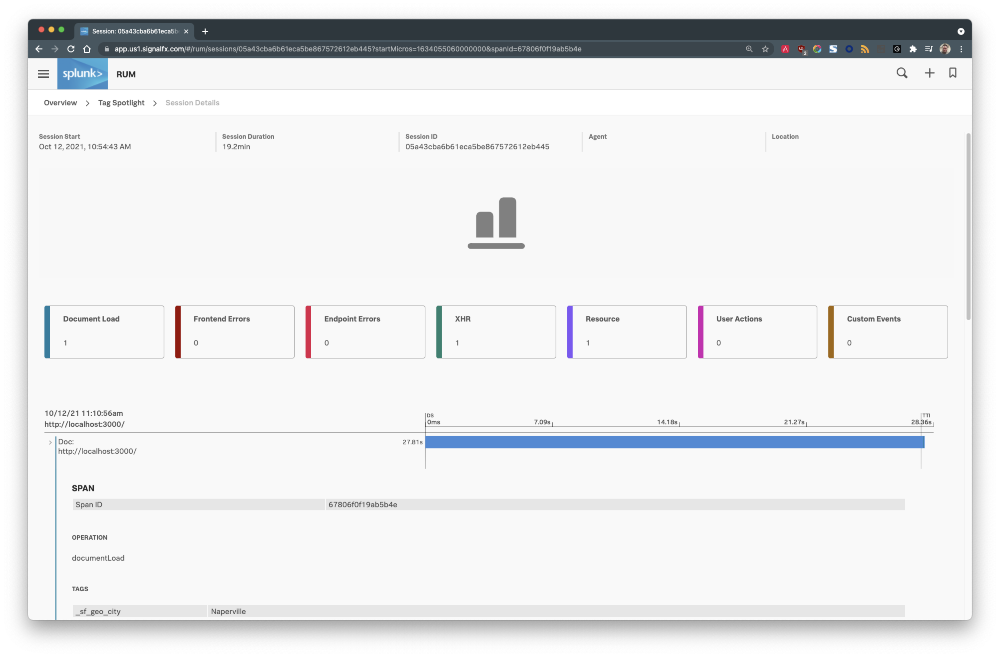
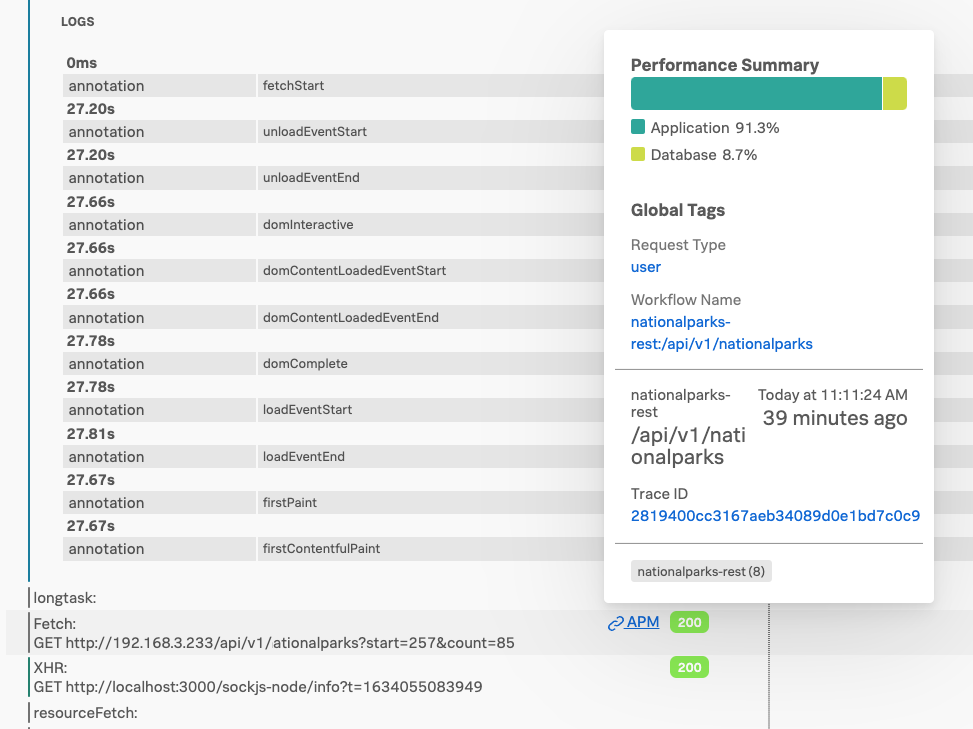
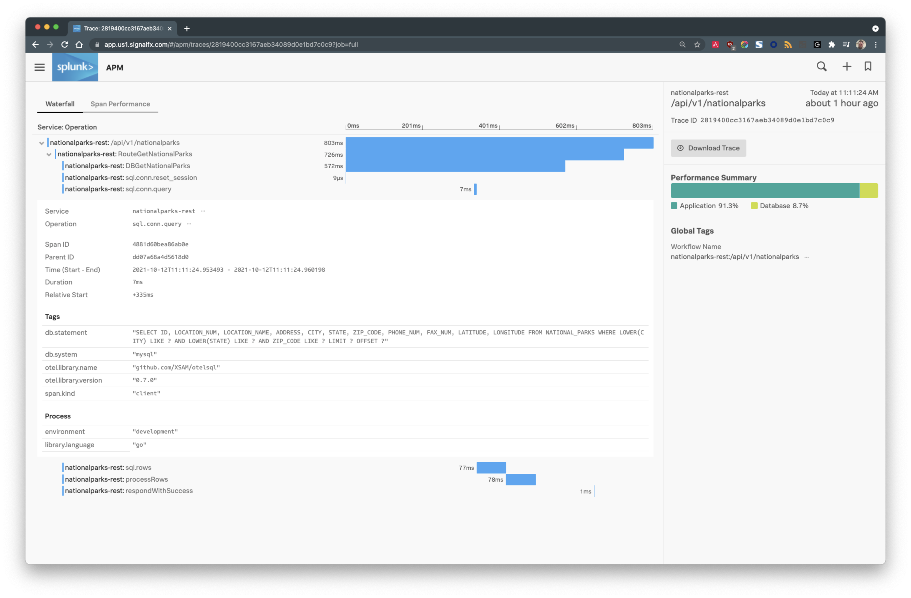

# National Parks React Frontend App

A simple React web application instrumented to produce Real User Monitoring (RUM) telemetry that is sent to Splunk Observability.

This frontend application utilizes the National Parks REST backend found in this repo: [https://github.com/billmeyer/nationalparks-rest]()

To follow along, this application has been documented as an article on Pusher blog. You can read about it [here](https://pusher.com/tutorials/consume-restful-api-react)

## Setup

1. To set up this project, first clone the repository

    ```bash
    $ git clone https://github.com/billmeyer/nationalparks-react.git
    ```

2. Change your working directory into the project directory

    ```bash
    $ cd nationalparks-react
    ```
   
3. Create a `.env.local` file in the project's top level directory with the following contents:

    ```env
    REACT_APP_RUM_ACCESS_TOKEN=<token>
    REACT_APP_RUM_REALM=<realm>
    REACT_APP_REST_BACKEND=<backend_url>
    ```
   
    where:
   
   * `<token>` should be replaced with a __RUM__ token from your Splunk Observability account.  See [https://app.<SPLUNK_REALM>.signalfx.com/#/organization/current?selectedKeyValue=sf_section:accesstokens]() for available tokens.
   * `<realm>` is the realm your Splunk Observability account is available in. (e.g., `us0`, `us1`, `eu0`, etc.)
   * `<backend_url>` is the URL to the National Parks REST backend in the format **http(s)://(hostname|ip address):(port)**. Example: `http://192.168.3.233`.

## Run

1. Install Node.js modules

    ```bash
    $ npm install
    ```

2. Start the development server

    ```bash
    $ npm start
    ```

## Evaluate

> **Note:** The links in this section use a Splunk Observability realm of `us1`.  If your realm is different, simply replace `us1` with your specific realm.

1. Starting the development server will automatically open browser session to [http://localhost:3000]().  The application will query the National Parks REST backend for a random series of National Parks to retrieve from the database.

   Because the application is capturing RUM data, we can observe the usage data in Splunk Observability at [https://app.us1.signalfx.com/#/rum]().  The first load of the React application's page load will result in a new entry appearing on the RUM dashboard:

   

2. Focusing on the **Highest P75 Page Load Times** section, click on the `http://localhost:3000` link:

   

   This will open the **Tag Spotlight** page which can be used to further filter the number of Example Sessions that have been captured.  Some examples of useful filter criteria include **Country**, **Region**, **Browser**, **OS Name** and many others.

3. Click the **Example Sessions** tab in the middle of the page.  This will show a list of the filtered web sessions that have been captured.  Click on one of the **Session ID**s:

   

4. The browser will display the details of the selected web session:

   

   This page represents all of the activity being performed on the user's web browser and the interactions with the backend web servers and services that support the application.

5. Scroll down the page looking for a `Fetch:` operation.  There should be a request to the National Parks REST api similar to this example:

   
   
   Hover over the **APM** link for a moment.  A popup should display details about the backend call to the National Parks REST Api including the URL called, a timestamp indicating when it was called and the **Trace ID**.

6. From here, we can move our focus from the user activity happening the browser to the backend web service activity being supplied by the National Parks REST APIs.  Click the **APM** link.

7. We will be shown a dashboard inside the **APM** module with the trace information for the National Parks REST Api automatically displayed:

   

   By expanding the various spans under the trace, we can gain insight as to what our application code is executing, where the time for each span is being spent, what the returned status code is and any additional metadata our application has provided as part of it's tracing.
